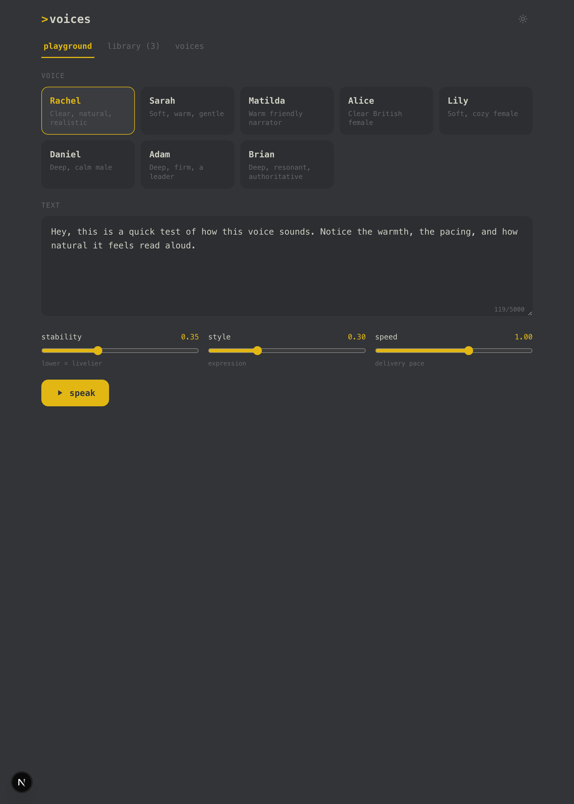
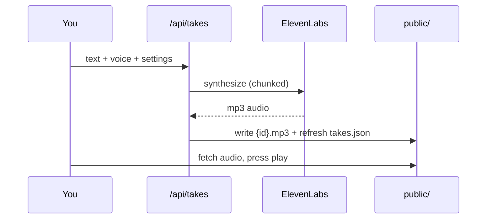
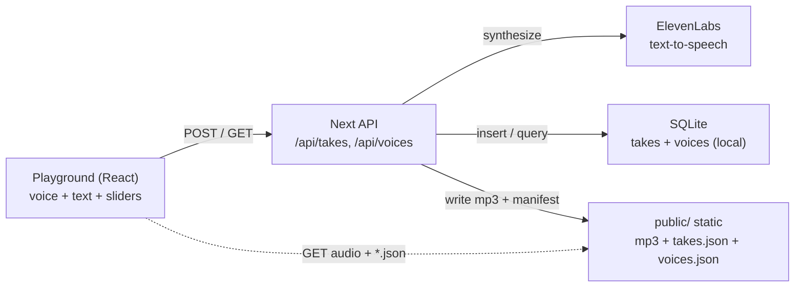
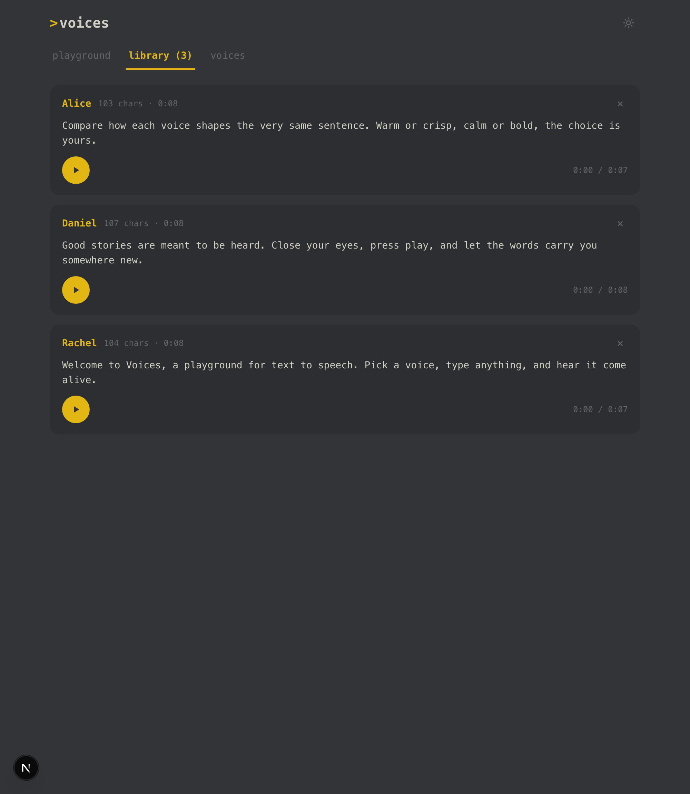

# Voices

A text-to-speech playground. Load your own voices, type any text, and hear it read aloud - compare tone, pacing, and delivery side by side, then save the takes you like.



[](LICENSE)


## Contents

- [Features](#features)
- [How it works](#how-it-works)
- [Architecture](#architecture)
- [Tech stack](#tech-stack)
- [Quick start](#quick-start)
- [Configuration](#configuration)
- [Project layout](#project-layout)
- [License](#license)

## Features

- Pick any voice, type or paste text, and hear it spoken with real narration (ElevenLabs)
- Load your **own** voices by ElevenLabs voice id and test them right beside the presets
- Tune delivery live: stability, style, and speed sliders per take
- Every synthesis is saved to a library with its own scrubbable player - compare takes
- Long text is chunked on sentence boundaries and stitched back into one seamless track
- Light + dark themes, mobile-first, installable (PWA), shareable tab links (`/?tab=library`)
- Read-only static deploy: the app ships a committed `takes.json` + audio, so it needs no
  writable database on serverless

## How it works



Synthesis runs server-side and only where an `ELEVENLABS_API_KEY` is present (your local
machine). The deployed site is read-only: writes return `401`, and the library plays the
committed sample takes.

## Architecture

A thin Next.js app: pure logic lives in `lib/` (and is unit-tested), the React playground
lives in `components/`, and the API routes synthesize audio. Audio is written under
`public/` and served as static files, so the deployed app reads a committed manifest and
needs no database.



| Module | Role |
| --- | --- |
| `lib/elevenlabs.ts` | TTS synth, sentence chunking, audio stitch (tested) |
| `lib/db.ts` / `lib/manifest.ts` | sqlite schema + static manifest export |
| `lib/auth.ts` | local/LAN or bearer-token write gate (tested) |
| `lib/voices.ts` | curated premade voices + helpers (tested) |
| `components/Playground.tsx` | voice picker + text + settings + speak |
| `components/Player.tsx` / `TakeList.tsx` | scrubbable audio + saved-take library |
| `app/api/takes`, `app/api/voices` | create (synthesize) + list + delete |

## Tech stack

- **Next.js 16** (App Router, Turbopack) + **React 19** + **TypeScript** (strict)
- **Tailwind CSS v4**
- **better-sqlite3** for local storage; a static `public/takes.json` manifest for serverless
- **ElevenLabs** text-to-speech
- **Vitest** + **Testing Library** for unit tests

## Quick start

```bash
git clone https://github.com/bunlongheng/voices.git
cd voices
npm install
cp .env.example .env.local   # add your ELEVENLABS_API_KEY
npm run dev                  # http://localhost:3037
```

Open the app, pick a voice, type something, and press **speak**. To test one of your own
ElevenLabs voices, go to the **voices** tab and load it by id.



## Configuration

Copy `.env.example` to `.env.local` and set:

| Variable | Required | What it does |
| --- | --- | --- |
| `ELEVENLABS_API_KEY` | yes (to synthesize) | server-side TTS key, never exposed to the client |
| `VOICES_DEFAULT_ID` | no | default voice id when a take doesn't specify one |
| `VOICES_TOKEN` | no | bearer token required for writes from non-localhost callers |
| `NEXT_PUBLIC_SITE_URL` | no | canonical URL for OpenGraph/metadata |

## Project layout

| Path | What lives there |
| --- | --- |
| `lib/` | pure logic: TTS, db, auth, voices, manifest |
| `components/` | React UI |
| `app/` | Next.js routes + API + icons + OG image |
| `public/` | synthesized audio + committed manifests |
| `tests/` | Vitest unit tests |

## License

[MIT](LICENSE) © Bunlong Heng
