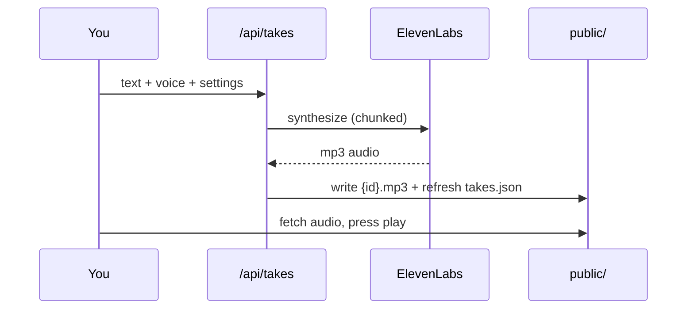
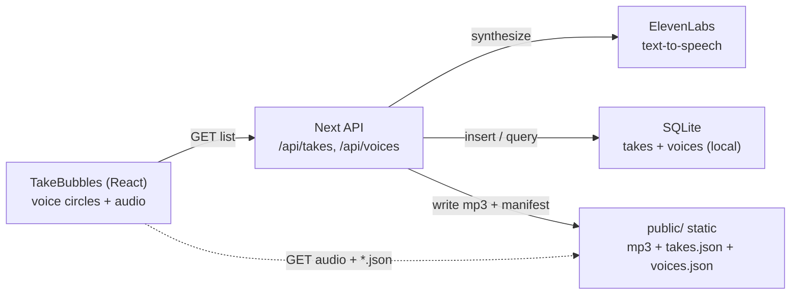

# Voices

A voice library on a pure-black canvas. Every text-to-speech take is a vibrant circle - Apple-Watch style - its colour derived from the voice. Tap to play, watch a white ring fill, and compare voices at a glance. Takes are synthesized with ElevenLabs (server-side) and served as static audio.


[](https://github.com/bunlongheng/voices/actions/workflows/ci.yml)
[](LICENSE)


Live: [voices-bheng.vercel.app](https://voices-bheng.vercel.app)

## Contents

- [Features](#features)
- [How it works](#how-it-works)
- [Architecture](#architecture)
- [Tech stack](#tech-stack)
- [Quick start](#quick-start)
- [Configuration](#configuration)
- [Project layout](#project-layout)
- [License](#license)

## Features

- Voice takes shown as vibrant Apple-Watch-style circles on pure black - each voice keeps
  a stable colour, and the circles gently float, waiting to be tapped
- Tap a circle to play, tap again to pause; a white progress ring fills, one plays at a time
- Real narration from ElevenLabs, synthesized server-side (long text is chunked on
  sentence boundaries and stitched into one seamless track)
- Hex-packed honeycomb layout that nests as more takes are added
- Minimal, single black theme; mobile-first, installable (PWA)
- Read-only static deploy: the app ships a committed `takes.json` + audio, so it needs no
  writable database on serverless

## How it works



Synthesis runs server-side and only where an `ELEVENLABS_API_KEY` is present (your local
machine). The deployed site is read-only: writes return `401`, and the library plays the
committed sample takes.

## Architecture

A thin Next.js app: pure logic lives in `lib/` (and is unit-tested), the React playground
lives in `components/`, and the API routes synthesize audio. Audio is written under
`public/` and served as static files, so the deployed app reads a committed manifest and
needs no database.



| Module | Role |
| --- | --- |
| `lib/elevenlabs.ts` | TTS synth, sentence chunking, audio stitch (tested) |
| `lib/db.ts` / `lib/manifest.ts` | sqlite schema + static manifest export |
| `lib/audio.ts` | audio file paths + public URLs (separate from the DB) |
| `lib/auth.ts` / `lib/rate-limit.ts` | write gate (local/LAN or bearer) + per-caller synth limit (tested) |
| `lib/voices.ts` | curated premade voices + helpers (tested) |
| `components/TakeBubbles.tsx` | the library as an Apple-Watch honeycomb of voice circles |
| `app/api/takes`, `app/api/voices` | create (synthesize) + list + delete |

## Tech stack

- **Next.js 16** (App Router, Turbopack) + **React 19** + **TypeScript** (strict)
- **Tailwind CSS v4** for the reset + base layer; the UI is styled with CSS custom properties and scoped inline styles
- **better-sqlite3** for local storage; a static `public/takes.json` manifest for serverless
- **ElevenLabs** text-to-speech
- **Vitest** + **Testing Library** for unit tests

## Quick start

```bash
git clone https://github.com/bunlongheng/voices.git
cd voices
npm install
cp .env.example .env.local   # add your ELEVENLABS_API_KEY
npm run dev                  # http://localhost:3037
```

Open the app to browse the voice library. New takes are synthesized server-side through
`POST /api/takes` (needs `ELEVENLABS_API_KEY`); the deployed site is read-only and plays
the committed sample takes.

```bash
# synthesize a take locally
curl -X POST http://localhost:3037/api/takes \
  -H 'content-type: application/json' \
  -d '{"text":"Hello from Voices","voice_id":"21m00Tcm4TlvDq8ikWAM"}'
```

## Configuration

Copy `.env.example` to `.env.local` and set:

| Variable | Required | What it does |
| --- | --- | --- |
| `ELEVENLABS_API_KEY` | yes (to synthesize) | server-side TTS key, never exposed to the client |
| `VOICES_DEFAULT_ID` | no | default voice id when a take doesn't specify one |
| `VOICES_TOKEN` | no | bearer token required for writes from non-localhost callers |
| `NEXT_PUBLIC_SITE_URL` | no | canonical URL for OpenGraph/metadata |

## Project layout

| Path | What lives there |
| --- | --- |
| `lib/` | pure logic: TTS, db, auth, voices, manifest |
| `components/` | React UI |
| `app/` | Next.js routes + API + icons + OG image |
| `public/` | synthesized audio + committed manifests |
| `tests/` | Vitest unit tests |

## License

[MIT](LICENSE) © Bunlong Heng
